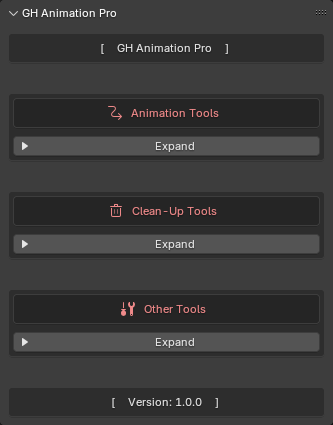

# GH Animation Pro - Blender Add-On

<h1 style="margin-bottom: 16px; margin-top: 32px;">Description:</h1>

  
<strong>GH Animation Pro - description</strong>

  
 

  

    <strong>GH Animation Pro</strong> is a <u>production‑oriented Blender toolkit</u> focused on precise control over character and object animation, from <u>IK locking</u> to <u>physics</u> and <u>timing refinement</u>. 
    It is designed for animators who need reliable, repeatable tools for <u>complex shots</u>, <u>interaction‑heavy scenes</u>, and <u>polishing mocap data</u>.[file:69]
  

  

    The add‑on provides <u>advanced IK lock management</u> that creates dedicated lock empties, NLA strips, and constraints, allowing you to <u>pin limbs in place</u>, bake those influences into clean pose animation, 
    and then automatically remove all helper objects, actions, and constraints once they are no longer needed.[file:69]
  

  

    A dedicated <u>Object Interactions</u> toolset helps quickly set up and bake interactions between characters and scene elements, such as <u>grabs, pushes, touches, hand‑on‑surface contacts</u>, or object attachments. 
    This makes it much easier to turn raw motion capture into convincing <u>physical contacts</u> between the character and props, environment, or other characters, while keeping the rig and actions manageable.[file:69]
  

  

    <u>Animated physics</u> tools let you add and bake physics‑driven motion into keyframes with a <u>controllable frame range</u>, quickly calculate to a specific frame, and completely clean up generated physics data when the shot is approved.[file:69]
  

  

    <u>Baking tools</u> support multiple modes, letting you bake full ranges or just the current frame, choose between <u>pose</u> and <u>object</u> data, and decide whether to overwrite the current action or create new ones. 
    Together with <u>quick frame‑range utilities</u> and saved frame‑range presets, this makes it fast to define, reuse, and adjust the exact segment of animation you want to process without constantly typing start/end frames by hand.[file:69]
  

  

    For timing control, GH Animation Pro includes <u>FPS Tweaks</u> tools that convert animation between different frame rates, with options to use the current scene FPS as a source, round keyframes to whole frames, 
    and automatically fix interpolation back to <u>Bezier</u> after scaling, which helps maintain <u>smooth arcs</u> after retiming.[file:69]
  

  

    Additional utilities cover <u>slow‑motion creation</u> based on duration and strength settings, <u>quick frame‑range management</u>, single‑frame baking for selected objects, and <u>adaptive F‑Curve cleanup</u> with configurable error thresholds 
    to reduce key density while preserving motion fidelity.[file:69]
  

  

    Together with IK locks and interaction tools, GH Animation Pro is well‑suited for cleaning up <u>sliding feet</u> and unstable contacts in mocap animation, allowing you to lock feet or hands in place when needed, 
    bake the corrected motion to keys, and remove all temporary helpers once the shot looks solid.[file:69]
  

  

    All tools are grouped in the GH Animation Pro panel in the 3D Viewport N‑panel under the <u>GH Tools</u> category, with collapsible sections for IK Lock Points, Object Interactions, Animated Physics, FPS Tweaks, and clean‑up utilities, 
    making the workflow suitable for <u>fast iteration</u>, troubleshooting, and export‑ready animation preparation in real production scenes.[file:69]
  

<h1 style="margin-bottom: 16px; margin-top: 32px;">Add-On Menu Preview:</h1>

  
<strong>Show GH Animation Pro Add-On Menu</strong>

  
 

  

    
  

<h2>Main Tabs</h2>

In the <strong>Add-On</strong> menu, you can find three main tabs:

- [Animation Tools](/Tabs/Animation%20Tools.md)
- [Clean-Up Tools](/Tabs/Clean-Up%20Tools.md)
- [Other Tools](/Tabs/Other%20Tools.md)

> ### [Documentation license](LICENSE)
> You may redistribute this documentation `unmodified` with proper attribution to the original author.  
> Modifications, translations, and derivative works are `not` allowed without explicit permission.